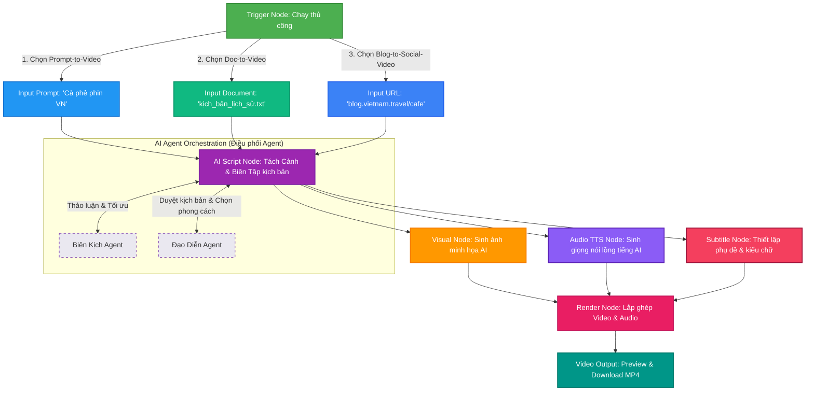

# Sơ đồ quy trình xử lý Workflow nâng cao (Advanced Workflow Diagram)

Dưới đây là 3 luồng kịch bản (Templates) chính và cách các Node liên kết hoạt động:

## Các giai đoạn xử lý chính:
1. **Khởi động theo Mẫu (Templates)**: Người dùng có thể bắt đầu từ một Prompt, tải lên một tệp tài liệu văn bản, hoặc dán đường dẫn trang web (URL blog).
2. **AI Agent Orchestration**: Script Agent và Director Agent sẽ phối hợp phân tách kịch bản thành từng cảnh phim chi tiết, gợi ý hình ảnh phù hợp và sinh lời bình thoại.
3. **Pipeline Đa Phương Tiện**: Sinh song song hình ảnh minh họa (Visual), âm thanh lồng tiếng (Audio TTS) và lớp chữ phụ đề (Subtitle Overlay).
4. **Hợp nhất (Render)**: Ghép tất cả thành tệp MP4 đồng nhất theo đúng tỷ lệ màn hình (9:16, 16:9, 1:1) đã thiết lập.
