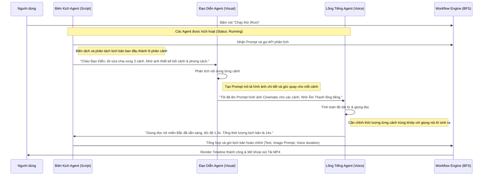

# Kế hoạch phát triển: Agent Orchestration (Tab Nhân Vật AI)

Tính năng này tập trung vào việc hiển thị cuộc hội thoại sinh động và luồng phối hợp làm việc nhịp nhàng giữa các AI Agent (Biên kịch, Đạo diễn hình ảnh, AI Voiceover) trong suốt quá trình chạy workflow để tạo nên kịch bản phân cảnh hoàn chỉnh.

---

## Giao diện Mockup Đề xuất (UX Mockup)

Dưới đây là thiết kế giao diện khu vực Điều phối Agent (Agent Orchestration) thuộc Tab Nhân Vật AI:

---

## 1. Thiết kế Giao diện người dùng (UI/UX)

Khu vực **Điều phối Agents** nằm trong Panel bên phải (Tab `agents` / "Điều phối Agents") sẽ được nâng cấp giao diện toàn diện theo phong cách Premium Light Theme với các đặc điểm:

### A. Hàng thẻ trạng thái Nhân Vật AI (Agent Cards)
Đặt ở trên cùng của panel, hiển thị 3 nhân vật hoạt động song song:
- **Biên Kịch Agent (Scriptwriter)**:
  - **Màu sắc**: Màu tím (`#a855f7`).
  - **Thông số cấu hình**: Lựa chọn Mô hình LLM (ví dụ: `GPT-4o`, `Claude 3.5`, `Gemini 1.5 Pro`).
  - **Trạng thái**: Đang chờ (idle) / Đang soạn kịch bản (writing) / Hoàn thành.
- **Đạo Diễn Agent (Art Director)**:
  - **Màu sắc**: Màu xanh dương (`#3b82f6`).
  - **Thông số cấu hình**: Lựa chọn Phong cách Visual (Cinematic, Anime, Realistic).
  - **Trạng thái**: Đang chờ / Đang lên bối cảnh (sketching) / Hoàn thành.
- **Lồng Tiếng Agent (AI Voiceover)**:
  - **Màu sắc**: Màu cam/vàng (`#f97316`).
  - **Thông số cấu hình**: Lựa chọn Giọng đọc (Vy Mai - Bắc, Nam, Trung) & Tốc độ (1.0x).
  - **Trạng thái**: Đang chờ / Đang lồng tiếng (speaking) / Hoàn thành.

*Mỗi thẻ có vòng sáng nhấp nháy (glowing micro-animation) khi Agent đó đang ở trạng thái hoạt động.*

### B. Khung trò chuyện đa Agent (Conversation Thread)
- Hiển thị bóng chat (chat bubbles) đẹp mắt đại diện cho từng Agent với màu sắc tương ứng.
- Có avatar riêng, tên Agent rõ ràng, và nhãn thời gian thực.
- Tích hợp hiệu ứng ba chấm nhấp nháy (`typing indicator`) khi Agent đang "suy nghĩ".
- Tự động cuộn xuống dưới cùng khi có tin nhắn mới (`auto-scroll`).

---

## 2. Luồng xử lý kỹ thuật (Workflow Diagram)

Sơ đồ thể hiện quá trình trao đổi thông tin tuần tự của các Agent khi chạy thử:

---

## User Review Required

> [!IMPORTANT]
> - Các Agent sẽ đối thoại bằng tiếng Việt hoàn toàn theo đúng quy chuẩn dự án.
> - Quá trình đối thoại sẽ được đồng bộ hoá trực tiếp với các Node trong canvas React Flow thông qua trạng thái của Engine. Khi một Node chạy, Agent tương ứng sẽ cập nhật trạng thái "Đang xử lý..." và xuất hiện nội dung hội thoại trên màn hình Console.

---

## Open Questions

> [!NOTE]
> 1. Bạn có muốn hiển thị thêm phần **cấu hình nhanh Prompt hệ thống (System Prompt)** cho từng Agent ngay trong tab này không, hay chỉ cần cấu hình Model LLM?
> 2. Kịch bản đối thoại khi người dùng chạy thử nên được tạo động hoàn toàn qua API (gọi LLM sinh hội thoại) hay sử dụng bộ khung tối ưu thông minh dựa trên kết quả sinh thực tế từ Node để đảm bảo tốc độ phản hồi nhanh nhất?

---

## Proposed Changes

### [Component Frontend]

#### [MODIFY] [App.tsx](file:///d:/AntiGravity/HML/src/App.tsx)
- Cập nhật định nghĩa giao diện phần `activeTab === 'agents'` để vẽ 3 Agent Cards nằm ngang và khung hội thoại kiểu CapCut/n8n.
- Tích hợp thay đổi trạng thái các Agent (`agentStatus: 'idle' | 'thinking' | 'active' | 'success'`) vào hàm `runWorkflow`.
- Nâng cấp luồng hội thoại giả lập tương tác thời gian thực phối hợp giữa 3 Agent dựa trên nội dung thực tế từ API.

#### [MODIFY] [index.css](file:///d:/AntiGravity/HML/src/index.css)
- Thêm CSS classes cho Agent Cards, bóng chat, hiệu ứng viền sáng nhấp nháy, hiệu ứng ba chấm đang gõ chữ (`typing-indicator`), và thanh cuộn đẹp hơn.

---

## Verification Plan

### Manual Verification
1. Chạy ứng dụng bằng lệnh `npm run electron:dev`.
2. Mở tab **Điều phối Agents** bên cột phải.
3. Bấm **Chạy thử (Run)** ở thanh công cụ trên cùng.
4. Kiểm tra xem:
   - Tab "Điều phối Agents" tự động được active.
   - Thẻ trạng thái các nhân vật AI sáng viền và thay đổi icon/badge khi bắt đầu hoạt động.
   - Các tin nhắn trao đổi hiển thị đẹp mắt, theo thứ tự logic Biên kịch -> Đạo diễn -> Lồng tiếng.
   - Hộp thoại có thanh cuộn tự động di chuyển xuống tin nhắn mới nhất.
5. Kiểm tra tính năng thay đổi cấu hình Model LLM của từng Agent xem có cập nhật đúng trạng thái và hiển thị trên thẻ trạng thái không.
