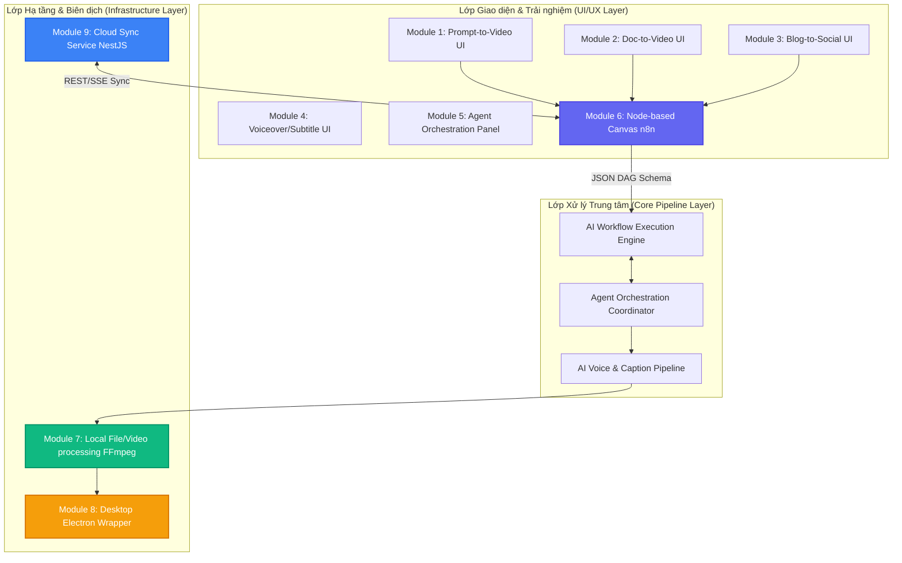

# Tài liệu thiết kế kiến trúc: Phân rã dự án HML thành các Module chuyên biệt

Tài liệu này định hình kiến trúc phân lớp của hệ thống ViệtFlow (HML), chia nhỏ toàn bộ ứng dụng thành các Module độc lập từ Frontend UX/UI, Core AI Pipeline, Local Engine cho đến Cloud Sync.

> [!IMPORTANT]
> **Nguyên tắc Trải nghiệm Cốt lõi (Core UX Principle)**:
> Bất kể các lớp hạ tầng và logic nghiệp vụ được phân tách sâu như thế nào, hệ thống ViệtFlow **bắt buộc phải giữ nguyên phong cách thiết kế kéo thả, dễ sử dụng, và trực quan cho tất cả người dùng (No-code Visual Graph)**. Sự phức tạp kỹ thuật của việc phân tách các module phải được che giấu hoàn toàn sau các Node, kết nối trực quan, và các nút điều khiển thân thiện.

---

## 1. Sơ đồ Kiến trúc Tổng thể (Module Architecture Diagram)

Dưới đây là sơ đồ tương tác đa lớp giữa các Module:



---

## 2. Chi tiết Thiết kế Từng Module

### 📦 MODULE 1: Prompt-to-Video (UX/UI)
* **Vai trò**: Giao diện tạo video nhanh trực quan từ ý tưởng văn bản.
* **Đặc tả No-code**: Người dùng chỉ cần gõ prompt ý tưởng chính và chọn phong cách hình ảnh từ dropdown mà không cần xử lý các mã lệnh lập trình.

### 📦 MODULE 2: Document-to-Video (UX/UI)
* **Vai trò**: Giao diện uploader kéo thả tài liệu để phân tách kịch bản phân cảnh tự động.
* **Đặc tả No-code**: Tải file lên và chọn cách thức phân đoạn trực quan (ví dụ: bóc theo từng câu, theo dòng hoặc đoạn văn).

### 📦 MODULE 3: Blog-to-Social-Video (UX/UI)
* **Vai trò**: Cung cấp ô nhập link URL bài viết và tự động cấu hình khuôn hình dọc (9:16) xây kênh mạng xã hội.
* **Đặc tả No-code**: Nhập địa chỉ trang web, hệ thống tự động bóc tách bài viết thành các phân cảnh dọc thích hợp.

### 📦 MODULE 4: AI Voiceover & Subtitle Pipeline (Core + UI)
* **Vai trò**: Đồng bộ hóa âm thanh và tạo phụ đề chạy chữ nghệ thuật cho video.
* **Đặc tả No-code**: Lựa chọn giọng nói (Vy Mai, Nam An...), điều chỉnh tốc độ qua thanh kéo trượt (`1.0x` - `1.5x`), chọn kiểu phụ đề qua các mẫu sẵn có (TikTok style, Vintage...) và bảng màu trực quan.

### 📦 MODULE 5: Agent Orchestration (Console UI + Core)
* **Vai trò**: Trình diễn luồng làm việc tự động và thảo luận giữa các nhân vật AI đại diện (Biên kịch, Đạo diễn hình ảnh, Âm thanh).
* **Đặc tả No-code**: Thể hiện tiến trình làm việc dưới dạng cuộc hội thoại sinh động dễ theo dõi, có thẻ hiển thị trạng thái động và thanh cấu hình prompt hệ thống trực quan.

### 📦 MODULE 6: Node-Based Workflow Canvas (VS Code / n8n-style)
* **Vai trò**: Không gian làm việc kéo thả chính để lắp ghép quy trình sản xuất video bằng đồ thị có hướng (DAG).
* **Đặc tả No-code**: Đây là trái tim của trải nghiệm trực quan. Người dùng kéo các thẻ node (Trigger, AI Script, Visual, Audio TTS, Subtitle, Render) từ danh mục bên trái, thả vào màn hình và dùng chuột vẽ đường nối các Node để liên kết chúng thành quy trình tự động hóa.

### 📦 MODULE 7: Local File & Video Processing System (FFmpeg Engine)
* **Vai trò**: Động cơ biên dịch video, âm thanh, phụ đề và hiệu ứng trực tiếp trên máy trạm của người dùng.
* **Đặc tả No-code**: Tự động chạy nền khi kích hoạt quy trình kéo thả, xuất file MP4 ra thư mục local watch chỉ định mà không yêu cầu người dùng gõ câu lệnh terminal.

### 📦 MODULE 8: Desktop App Wrapper (Electron Process)
* **Vai trò**: Đóng gói toàn bộ nền tảng web thành phần mềm chạy độc lập trên Windows/macOS.
* **Đặc tả No-code**: Chạy ứng dụng dưới dạng cửa sổ desktop app thân thiện, tự khởi động backend ngầm và đi kèm bộ cài đặt trọn gói.

### 📦 MODULE 9: Cloud Project Synchronization Service (NestJS REST API)
* **Vai trò**: Lưu trữ trạng thái workflow, cấu hình render và phiên bản của dự án lên cơ sở dữ liệu để đồng bộ hóa.
* **Đặc tả No-code**: Tự động lưu trữ dự án mỗi khi người dùng vẽ biểu đồ, lưu trữ bản sao lưu và hỗ trợ xuất bản chỉ với 1 click chuột.

### 📦 MODULE 10: AI Workflow Builder & Video Generation Platform
* **Vai trò**: Cỗ máy quản lý tổng thể, chịu trách nhiệm xếp hàng công việc (Queue), xử lý failover khi API AI sập và điều khiển kết xuất.
* **Đặc tả No-code**: Quản lý hàng đợi render và phân phối API tự động, đảm bảo ứng dụng luôn chạy mượt mà ngay cả khi nhà cung cấp dịch vụ AI bị gián đoạn.

---

## 3. Bản đồ Giao tiếp & Giao diện (Interfaces / APIs)

Sự phối hợp giữa các Module được chuẩn hóa qua các giao diện REST APIs và kiểu dữ liệu TypeScript sau:

```typescript
// Giao diện trao đổi cấu hình dự án giữa Frontend (M6) và Cloud Sync (M9)
export interface ProjectSyncData {
  projectId: string;
  projectName: string;
  nodes: ReactFlow.Node[];
  edges: ReactFlow.Edge[];
  scenes: Scene[];
  aspectRatio: '9:16' | '16:9' | '1:1' | '4:5' | '21:9';
  renderConfig: RenderConfig;
}

// Giao diện yêu cầu Render giữa Engine (M10) và local FFmpeg (M7)
export interface RenderJobRequest {
  jobId: string;
  scenes: Scene[];
  aspectRatio: string;
  voiceVoice: string;
  subStyle: string;
  outputDir: string;
}
```
