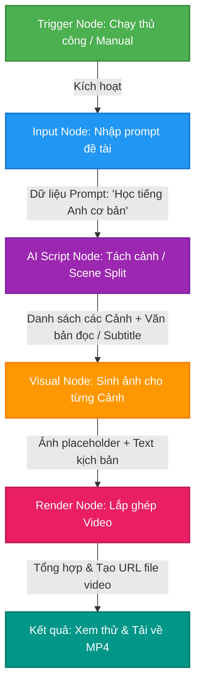

# Sơ đồ quy trình xử lý Workflow (Workflow Diagram)

Sơ đồ dưới đây thể hiện luồng chạy dữ liệu của DAG từ khi kích hoạt đến khi render video thành công:

## Giải thích luồng hoạt động
1. **Trigger Node**: Phát ra tín hiệu bắt đầu (Start signal).
2. **Input Node**: Nhận cấu hình chủ đề hoặc prompt từ người dùng và đẩy sang cho node tiếp theo.
3. **AI Script Node**: Gọi API (hoặc mock API) để chia nhỏ prompt thành cấu trúc kịch bản gồm các cảnh (Scene 1, Scene 2, Scene 3) kèm lời bình thoại (Voice-over) và mô tả hình ảnh cho cảnh đó.
4. **Visual Node**: Dựa trên mô tả hình ảnh của từng cảnh để sinh ảnh minh họa (hoặc lấy ảnh mock chất lượng cao).
5. **Render Node**: Ghép hình ảnh, phụ đề (Subtitle) và tạo hiệu ứng chuyển động cơ bản để xuất ra file video MP4.
